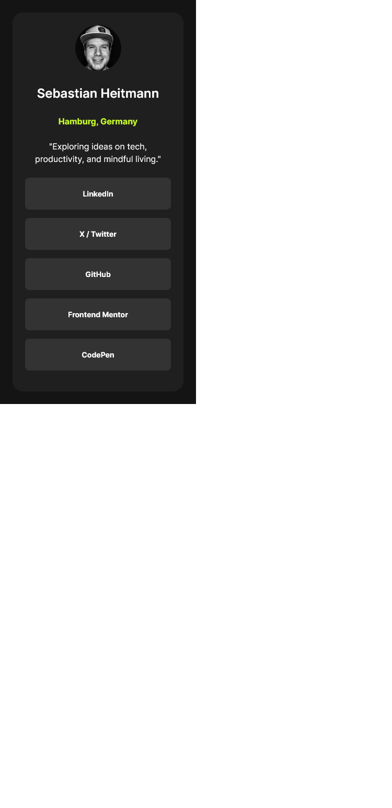
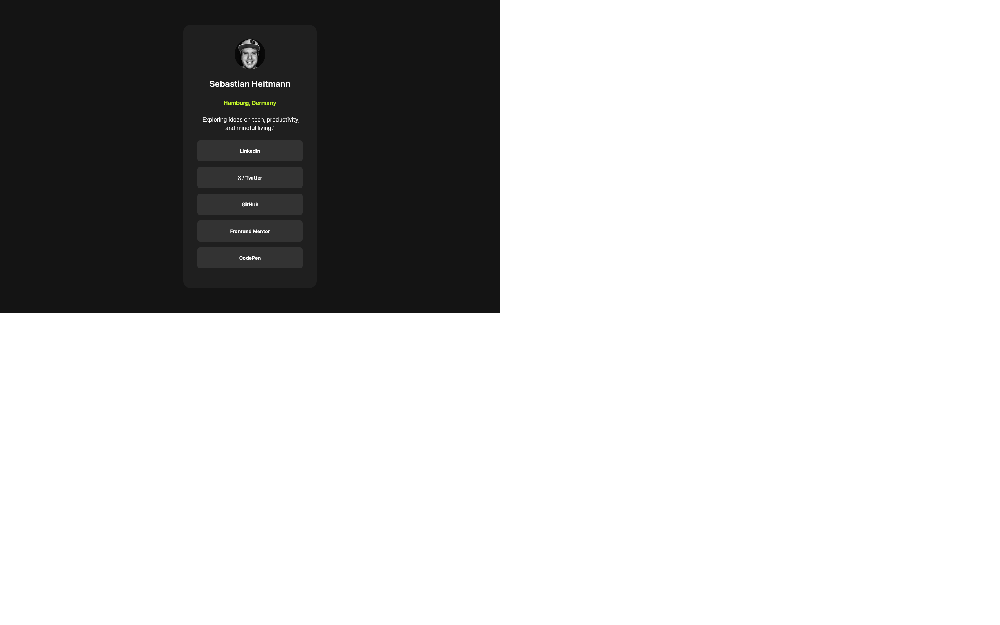

# Frontend Mentor - Social links profile solution

This is a solution to the [Social links profile challenge on Frontend Mentor](https://www.frontendmentor.io/challenges/social-links-profile-UG32l9m6dQ). Frontend Mentor challenges help you improve your coding skills by building realistic projects.

## Table of contents

- [Overview](#overview)
  - [The challenge](#the-challenge)
  - [Screenshot](#screenshot)
  - [Links](#links)
- [My process](#my-process)
  - [Built with](#built-with)
  - [What I learned](#what-i-learned)
  - [Continued development](#continued-development)
  - [Useful resources](#useful-resources)
- [Author](#author)
- [Acknowledgments](#acknowledgments)

## Overview

### The challenge

Users should be able to:

- See hover and focus states for all interactive elements on the page

### Screenshot

Here is the mobile view:


Here is the desktop view:


### Links

- Solution URL: [https://github.com/DonHeidi/social-links-profile](https://github.com/DonHeidi/social-links-profile)
- Live Site URL: [https://donheidi.github.io/social-links-profile/](https://donheidi.github.io/social-links-profile/)

## My process

Straight forward. I laid out the structure of the content and then replaced the links with web components. I used a JSON file to load the data for the social links.
The last step was to add the styling and refine the responsive behaviour.

### Built with

- Semantic HTML5 markup
- Web Components
- Flexbox

### What I learned

I focused on learning Web Components. I have built two components: a social link and a section of social links.

Here is the code for the social link component:

```javascript
// creating the template for the social link and adding the styles. The slot is used to pass the content from the markup file to the component
const linkListItemTemplate = document.createElement('template')
linkListItemTemplate.innerHTML = `
  <style>
    a, a:visited, a:link, a:active {
      display: block;
      background-color: ${grey};
      width: 100%;
      padding-block: 1.25rem;
      text-align: center;
      text-decoration: none;
      transition: background-color 0.3s;
      color: ${white};
      font-weight: 700;
      font-size: 14px;
      line-height: 1.5;
      border-radius: 0.5rem;
    }

    a:hover {
      color: ${grey};
      background-color: ${neonGreen};
    }

    li {
      list-style: none;
      width: 100%;
      display: block;
    }

  </style>
  <li><a><slot></slot></a></li>
`
// creating the class for the social link
class LinkListItem extends HTMLElement {
  // these are the attributes that can be set on the social link
  static get observedAttributes() {
    return ['href', 'alt']
  }

  // constructor to create the shadow DOM and to append the template to it. The href and alt attributes are set here, too.
  constructor() {
    super()
    const shadow = this.attachShadow({ mode: 'open' })
    shadow.appendChild(linkListItemTemplate.content.cloneNode(true))
    shadow.querySelector('a').href = this.getAttribute('href')
    shadow.querySelector('a').alt = this.getAttribute('alt')
  }

  // listen for changes to the attributes
  attributeChangedCallback(name, oldValue, newValue) {
    switch (name) {
      case 'href':
        this.shadowRoot.querySelector('a').href = newValue
        break
      case 'alt':
        this.shadowRoot.querySelector('a').alt = newValue
        break
    }
  }
}

// Define the template, so it can be used in the markup file
customElements.define('link-list-item', LinkListItem)
```

I decided to dynamically load the social links from a JSON file. Thats, why I am mapping over the JSON file and creating a social link for each entry.
As an alternative, I could have used the solial link in the html.

This snippet fetched the data and creates a profile-section element that is a container for the social links. The profile-section element is a web component, too.

I am not using the title currently in the template of the profile-section but I could use it in the future. the attribute slot is defining, which slot in the template should be used.

The social links are created as link-list-item elements and are appended to the profile-section element.

```javascript
fetch('assets/profile.json')
  .then((response) => response.json())
  .then((data) => {
    console.log(data)
    data.forEach((profile) => {
      const profileSection = document.createElement('profile-section')
      profileSection.innerHTML = `<h2 slot="title">${profile.displayName}</h2>`

      const links = profile.links.map((link) => {
        return `<link-list-item slot="item" href="${link.url}" alt="${link.displayName}">${link.displayName}</link-list-item>`
      })

      profileSection.innerHTML += links.join('')
      profiles.appendChild(profileSection)
    })
  })
  .catch((error) => {
    console.error('Error:', error)
  })
```

### Continued development

I plan to use this component with my personal design system and to use it in my personal website.

Web components feel very inconvenient to use. In my opinion, tools like React or Vue offer better ways to build reusable components.

### Useful resources

- [About web components](https://developer.mozilla.org/en-US/docs/Web/API/Web_Components) - I have used this as my reference to understand Web Components.
- [Tutorial by Web Dev Simplified](https://www.youtube.com/watch?v=2I7uX8m0Ta0&t=456s) - This got me started really fast.

## Author

- Website - [Sebastian Heitmann](https://donheidi.github.io/social-links-profile/)
- Frontend Mentor - [@DonHeidi](https://www.frontendmentor.io/profile/DonHeidi)
- Twitter - [@e2e_developer](https://www.twitter.com/e2e_developer)
- LinkedIn - [Sebastian Heitmann](https://www.linkedin.com/in/sebastian-heitmann/)

## Acknowledgments

Shout out to Kyle from Web Dev Simplified for his great tutorial on Web Components. It helped me a lot to understand the concept and to build my first Web Component.
